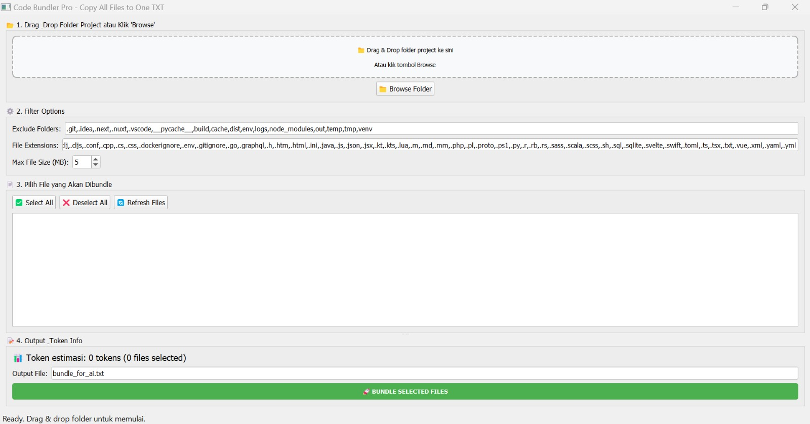
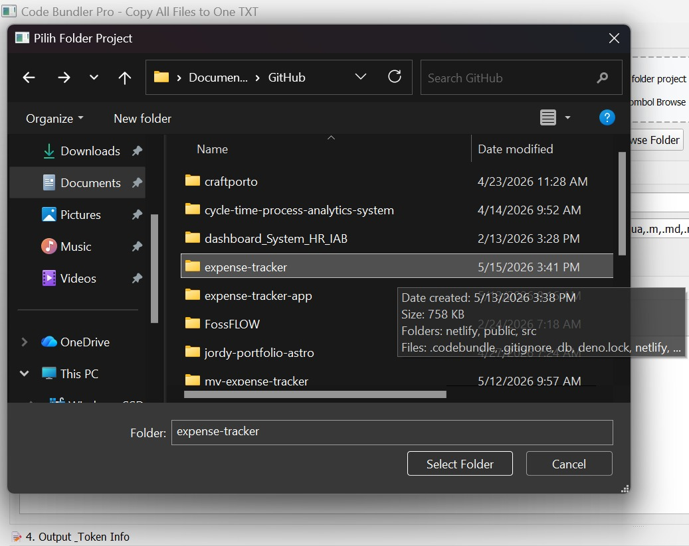
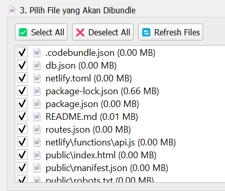
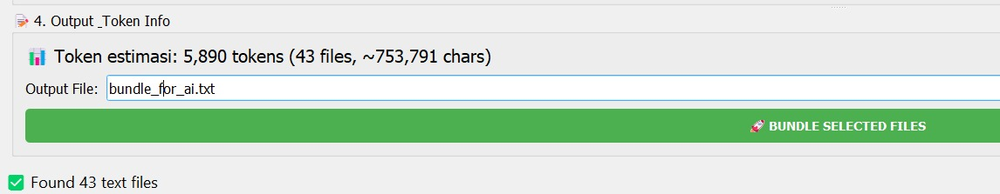
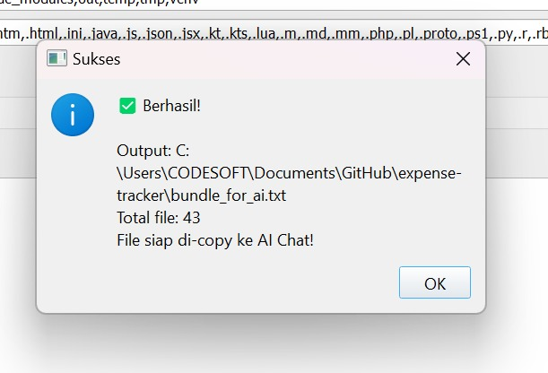
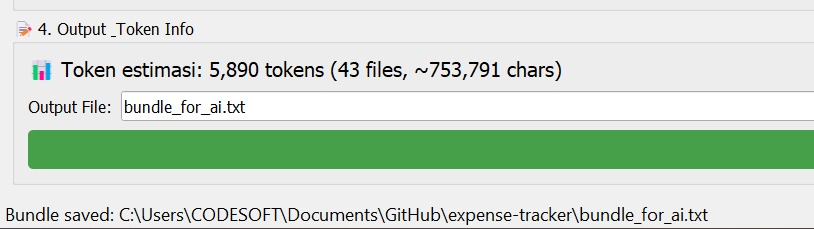
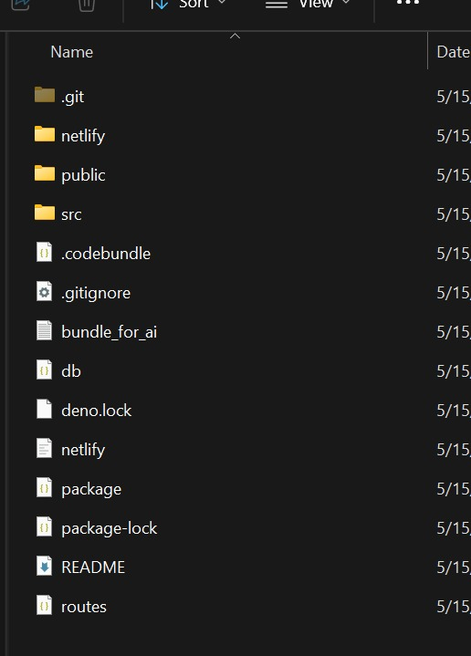
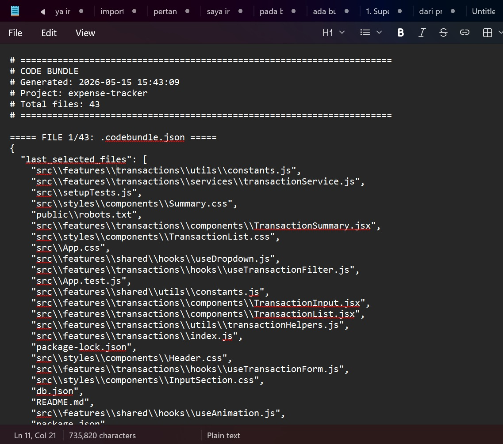

# Code Bundler Pro

**Satu klik untuk menggabungkan semua kode project Anda ke dalam 1 file**

[](https://python.org)
[](https://riverbankcomputing.com/software/pyqt/)
[](LICENSE)
[]()



## **Permasalahan yang Diselesaikan**

> *"kesulitan copy-paste ataupun mengakses file project satu per satu. Jika file terlalu banyak, itu akan memakan waktu berjam-jam!"*

**Solusi:** Code Bundler Pro membaca SEMUA file kode Anda (Python, JavaScript, HTML, CSS, JSON, dll), lalu menggabungkannya ke **1 file .txt** yang rapi dan siap pakai.

---

## **Fitur Unggulan**

| Fitur | Status | Deskripsi |
|-------|--------|------------|
| **Drag & Drop** | ✅ | Cukup drag folder project ke aplikasi |
| **GUI Modern** | ✅ | Antarmuka grafis yang mudah digunakan |
| **Token Counter** | ✅ | Estimasi token untuk GPT-4/ChatGPT (akurat!) |
| **Auto Exclude** | ✅ | Otomatis abaikan `node_modules`, `.git`, `__pycache__`, dll |
| **Save Preferences** | ✅ | Pengaturan tersimpan otomatis |
| **Multi-threading** | ✅ | Scan file tanpa freeze aplikasi |
| **Pilih File Manual** | ✅ | Centang file mana saja yang ingin dibundle |
| **Size Limit** | ✅ | Abaikan file > 5MB (bisa diatur) |
| **Custom Extensions** | ✅ | Tambah ekstensi file apapun |
| **Cross-platform** | ✅ | Windows, macOS, Linux |

---

## **Quick Start**

### **Instalasi (3 Langkah)**

```bash
# 1. Clone repository
git clone https://github.com/JordyMail/ACode-Bundler-Pro.git
cd Code-Bundler-Pro

# 2. Install dependensi
pip install -r requirements.txt

# 3. Jalankan aplikasi
python src/code_bundler_pro.py
```

## How to Use?

### 1. Open the Application
<p align="center">
  
</p>

Launch the application to access the main interface.

---

### 2. Select the File
<p align="center">
  
</p>

Click the file selection button and choose the file you want to process.

---

### 3. Add the File
<p align="center">
  
</p>

After selecting the file, it will appear in the file list.

---

### 4. Processing the File
<p align="center">
  
</p>

The application will start processing the selected file.

---

### 5. Confirmation Message
<p align="center">
  
</p>

A confirmation popup will appear when the process is completed successfully.

---

### 6. Open File Location
<p align="center">
  
</p>

The application will provide the output file path.

---

### 7. View Output Directory
<p align="center">
  
</p>

Open the output folder to view the processed files.

---

### 8. Result File
<p align="center">
  
</p>

The processed result file is now ready to use.
